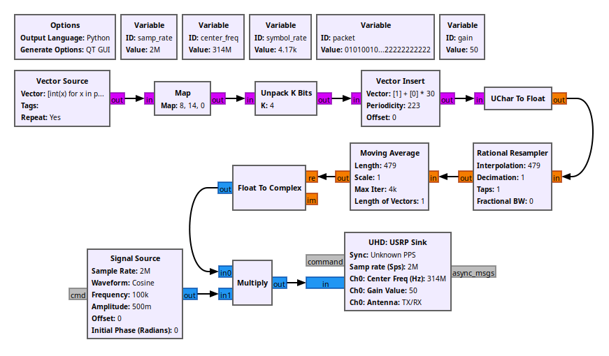
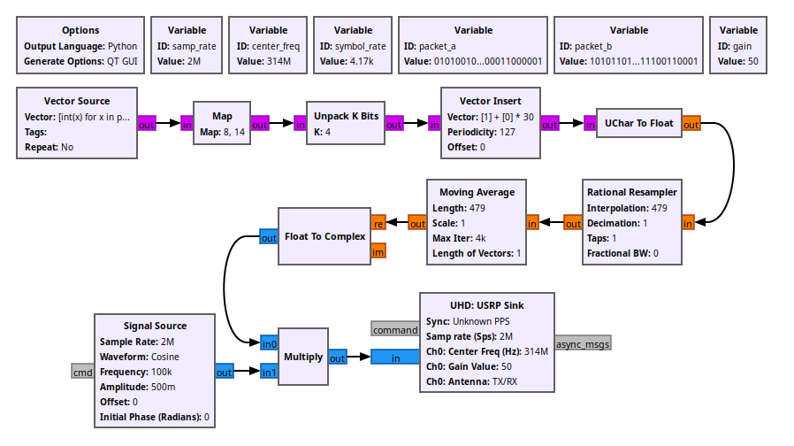

# Bente B-517 RF Hacking

  

I analyzed RF signals from `Bente B-517` and found that the product is vulnerable to a replay attack as well as a signal forgery. I also found a peculiarity on `HS1527 OTP Encoder` where the encoder did not provide enough security as described in the datasheet.

## Product Description

`Bente B-517` is a remote control switch that uses RF signals to control the receiver from within a range of 25 meters. 4 buttons (`A`, `B`, `C`, `D`) perform the following actions.

| Button | Action               |
| ------ | -------------------- |
| A      | On                   |
| B      | Off                  |
| C      | Off after 18 seconds |
| D      | Toggle On and Off    |

## Signal Capture

In order to capture the signal for analysis, we need to know the frequency it uses. By searching for signals in the range of `[300 MHz, 400 MHz]` with [gnuradio](https://github.com/gnuradio/gnuradio) and `USRP-2901`, I was able to locate the frequency `314 MHz` that is used by `Bente B-517`. To ease the process of frequency scanning, I added the block `Simple Squelch` to mute all background noise and display only the target signal by setting a threshold on the signal magnitude.

With the frequency found, I captured signals at `314 MHz` frequency with a bandwidth of `2 MHz`. `gain` was also increased to 50 to better distinguish the signal from background noise.

Before moving on to signal analysis, I checked if `Bente B-517` is vulnerable to a replay attack by transmitting the saved signal. When the captured signal of button `D` was replayed, LED light turned on and off repeatedly, showing that `Bente B-517` is susceptible to a replay attack.

  

## Signal Demodulation

Below are the captured signals from 10 button presses of button `D` shown in the [Universal Radio Hacker (URH)](https://github.com/jopohl/urh) interface.

By focusing on a single button press, I noticed that the same chunk of signals were being sent 3 ~ 5 times per button press. Also, signals seemed to consist of short and long signals, both having constant magnitude and signal length.

In order to determine the modulation used, I analyzed the waveform from the signal. Since frequency and phase did not seem to change, I ruled out [Frequency-shift keying (FSK)](https://en.wikipedia.org/wiki/Frequency-shift_keying) and [Phase-shift keying (PSK)](https://en.wikipedia.org/wiki/Phase-shift_keying) as the modulation method. With further observation, I noticed that signals were represented with the presence or absence of a wave, indicating the use of [On–off keying (OOK)](https://en.wikipedia.org/wiki/On%E2%80%93off_keying).

Since `OOK` is a form of [Amplitude-shift keying (ASK)
](https://en.wikipedia.org/wiki/Amplitude-shift_keying), I was able to demodulate the signal by setting `Samples/Symbol` to the length of a short signal and performing an `ASK` demodulation.

## Signal Decoding

In order to find the encoding used by `Bente B-517`, I looked into the PCB to find that the board only used a single IC chip, `HS1527`, which seemed to be generating the signals. With a bit of searching, I was able to find a datasheet for [HS1527 OTP Encoder](datasheet/HS1527_Silvan.pdf) that fortunately contained necessary information to decode the signal. First, by reading the output format below, I learned that the signal consists of a preamble, data from `C0` to `C19` and data from `D0` to `D3`. I also realized that the premable consists of 31 symbols, and the rest 24 data of 4 symbols each, `1110` or `0111`, based on whether the data is high or low.

  

Next, I found that `D0` to `D3` is mapped one-to-one to `K0` to `K3` which is buttons `A` to `D`.

  

  

Finally, for `C0` to `C19`, there is a description from the datasheet that mentions,

> HS1527 is OTP Encoder utilizing CMOS techonology process. HS1527 has a maximum of 20 bits providing up to 1 million codes. It can reduce any code collision and unauthorized code scanning possibilities.

Judging from the output format and the description, `C0` to `C19` seemed to be the 20 bits of data that provides 1 million codes (<code>220 = 1048576 ≅ 10^6</code>), although there were no information on how `C0` to `C19` were decided.

With enough information gathered, I was able to decode the signal by creating a custom decoding and applying it to the captured signal.

However, the result was not quite in line with the information from the datasheet. Although it properly processed the preamble on the first row, it listed 25 bits of data on the second row instead of 24. After some contemplation, I realized that the signals were being sent without any delays, and that the final bit `0` was in fact a preamble from the second signal instead of the <code>25th</code> data from the first signal. Therefore, by excluding the preamble of the second signal, I was able to find the proper 24 bit data from the signal.

By repeating this process for all signals from buttons `A` to `D`, I was able to successfully extract the following data that can be used in forging the signal.

| Button | Data                     |
| ------ | ------------------------ |
| A      | 010100101011100011001000 |
| B      | 010100101011100011000100 |
| C      | 010100101011100011000010 |
| D      | 010100101011100011000001 |

Before moving on to signal forgery, there was something unusual about the signal that I noticed during the decoding process. When I first read the name `HS1527 OTP Encoder`, I thought the term `OTP` was used to describe [One-time password](https://en.wikipedia.org/wiki/One-time_password), which lead me to believe that the bits from `C0` to `C19` would constantly change. However, when actually decoding the signal, I found that the first 20 bits are fixed at `01010010101110001100`, meaning that they are not used as an `One Time Password`. [One-time pad](https://en.wikipedia.org/wiki/One-time_pad) was ruled out for the same reason because one of the conditions for `One Time Pad` is that the encryption key must never be reused in whole or in part. If `OTP` stood for `One Time Pad`, it would use different keys every time, which would result in a different cipher every time. There is also the fact that `One Time Pad` does not share the key through transmission, but instead uses a pre-shared key. After searching for the different meanings of `OTP`, I found the term [One Time Programmable](https://en.wikipedia.org/wiki/Programmable_ROM#:~:text=OTP) which seemed to be the intended meaning of `OTP` for `HS1527`. If we interpret `OTP` as `One Time Programmable`, then bits from `C0` to `C19` would be unique keys programmed at the factory that's paired with a receiver so that only one transmitter can activate one receiver. This does seem to be what the datasheet is implying when it states

> It can reduce any code collision and unauthorized code scanning possibilities.

However, as there are only 1 million possible unique keys, it is trivial to brute-force data from `C0` to `C19` and activate any receiver that uses `HS1527`. Since the wavelength of a symbol is `240 μs`, transmitting a single singal would take around `30 ms`. Therefore, transmitting 1 million signals would take `30 Ks` which is roughly 8 hours. Even when considering worst case scenarios and delays between signals, it would take less than a day to brute-force and find unique keys for any devices that utilizes `HS1527`.

## Signal Forgery

With signal analysis complete, I reconstructed signals from `Bente B-517` using `gnuradio` once more. To do so, I first created a squared signal using the `Vector Source` block. This diagram performs the following operations:

1. Convert the string `01010010101110001100`, which represents the signal, into an array of integers.
2. Map each elements from the vector source using a dictionary `{0: 0b1000, 1: 0b1110}`,  
   e.g., `[0, 1]` => `[8, 14]`
3. Convert each element to 4 output bits,  
   e.g., `[8, 14]` => `[1, 0, 0, 0, 1, 1, 1, 0]`
4. Add preamble to all signals by repeating it at a cycle of 127 bits (31 bit preamble + 4 \* 24 bit data) starting from offset 0.
5. Convert unsigned char to float

Next, I upsampled the squared signal to match the original signal's symbol rate, `4.17 KHz`. By analyzing the previously captured signal in a time domain, I found that the wavelength for a single symbol is `240 μs`, which sets the symbol rate at `1 / 240 μs ≅ 4.17 KHz`.

Using this knowledge, I added 2 new blocks to the previous diagram. `Rational Resampler` block resamples the input signal and `Moving Average` block computes a moving average of the input. These blocks can be combined to create a squared wave with desired sampling rate by setting the `Interpolation` factor from `Rational Resampler` and `Length` from `Moving Average` to `samples / symbol`. As I was planning on sending the forged signal using the same sample rate from the signal capture, `samples / symbol` was determined at `samples / symbol = sample rate / symbol rate = 2 MHz / 4.17 KHz ≅ 479`. The upsampled signal shows that its symbol indeed has a wavelength of `240 μs`, identical to the original signal.

I then multiplied the result to a carrier wave with a frequency of `100 KHz` to modulate the signal using an `OOK` technique. Frequency value of `100 KHz` was calculated based on the wavelength of the original signal which is `10 μs`, thus the frequency of `1 / 10 μs = 100 KHz`.

By checking the output signal, I was able to confirm that the result is an `OOK` modulated signal with a symbol length of `240 μs` and wavelength of `10 μs` just as intended.

As the reconstruction of signal was successful, I tested transmitting the forged signal of button `D` to check if was functional. However, the receiver showed 2 different results based on the value of `Repeat` in the `Vector Source` block, and the signal failed to work as expected in both cases.

| Repeat | Result         |
| ------ | -------------- |
| No     | Did not toggle |
| Yes    | Toggled once   |

Looking at the result above, my first instinct was that the failure was due to a mixture of bad reception and lack of delay. From the sigal analysis, I showed that the same signal was sent 3 ~ 5 times per button press. If `Bente B-517` was built under the assumption that it would have a bad reception rate, than it makes sense for the transmitter to send multiple signals to raise the probability of receiver properly receiving the signals sent. In this case, there must be a processing mechanism for the receiver in case the reception rate was better than expected. Because if it doesn't exist, then the receiver would process all incoming signals, causing it to toggle multiple times in a span of less than a `1 ms`. If the receiver required a delay after successfully receiving a signal to prevent the processing of consecutive signals, than the receiver toggling only once as shown above makes sense as I did not put any delays in between the repeated signals. Based on these assumptions, I modified the diagram to create a delay between signals and tested transmitting them once again.

Unfortunately, no matter how much delay I set between the signals, receiver toggled only once. This time, I took a different approach and looked for the minimum number of signals required to trigger the receiver. By gradually reducing the number of signals from 5, I found that the receiver required at least 2 consecutive signals in order for it to toggle on and off. As the result was quite consistent, I realized that a single signal not being processed by the receiver was not due to a bad reception but instead due to an unknown processing mechanism of the receiver.

| Number of Signals | Result         |
| ----------------- | -------------- |
| 5                 | Toggled once   |
| 4                 | Toggled once   |
| 3                 | Toggled once   |
| 2                 | Toggled once   |
| 1                 | Did not toggle |

Next, I tested sending broken signals which had improper data on `C0` to `C19`, to check if it had any affect on the outcome. Surprisingly, I discovered that when a broken signal is sent after a proper signal, it caused the receiver to toggle once just like when two proper signals were sent.

| Signal Combination            | Result         |
| ----------------------------- | -------------- |
| proper signal + proper signal | Toggled once   |
| broken signal + proper signal | Did not toggle |
| proper signal + broken signal | Toggled once   |
| broken signal + broken signal | Did not toggle |

Finally, since the format of the second signal did not seem to matter for the signal to function, I started reducing the number of bits sent by the second signal and recorded the results. It turned out that the receiver still functions even when the second signal is reduced to a single bit. At this point, I realized that the first bit from the second signal's preamble was acting as a postamble for the first signal. In other words, unlike what I previously thought, signal from `Bente B-517` is 128 bits long consisting of 31 bit preamble, 96 bit data and 1 bit postamble.

With the problem solved, I created a [Signal Formatter](gnuradio/signal_formatter.py) block that formats the signal with a specified preamble, postamble and delay. By replacing the `Vector Insert` block with the custom block and setting the variables based on the values found so far, I was able to reconstruct the signal and show that `Bente B-517` is vulnerable to a signal forgery.

  

